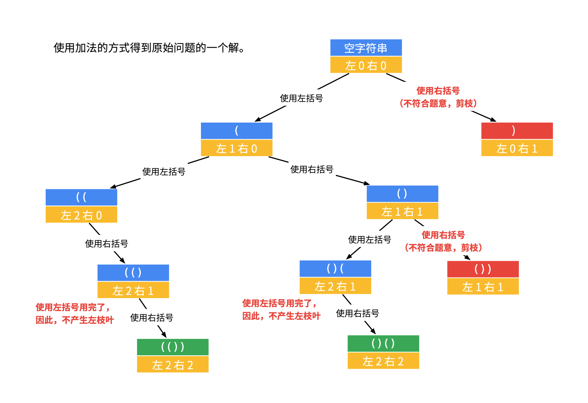

# 22. 括号生成: 

[22. 括号生成](https://leetcode-cn.com/problems/generate-parentheses/)

```
数字 n 代表生成括号的对数，请你设计一个函数，用于能够生成所有可能的并且 有效的 括号组合。

 

示例 1：

输入：n = 3
输出：["((()))","(()())","(())()","()(())","()()()"]
示例 2：

输入：n = 1
输出：["()"]
 

提示：

1 <= n <= 8
```
## Python

参考威哥的题解：[回溯算法（深度优先遍历）+ 广度优先遍历（Java）](https://leetcode-cn.com/problems/generate-parentheses/solution/hui-su-suan-fa-by-liweiwei1419/)

### 方法 1: 深度优先遍历

#### 思路

* 主要思路：用深度优先算法，「回溯 + 剪枝」
* 由 n 确定可以用于组成字符串的括号对，如 n=2，则有 2 个"(" 与 2 个 ")"可用。
* 要组成 **有效的** 的括号组合
    * 先出「左括号」，再出「右括号」
    * 也即剩余的「右括号」数量，必须 **大于或等于** 剩余的「左括号」数量

具体思路看下图


```python
class Solution:
    def generateParenthesis(self, n: int) -> List[str]:

        def dfs(path, left, right, res):
            # 当左右括号都用完时，添加到结果集中
            if left == 0 and right == 0:
                res.append(path)
                return
            # 如果「右括号剩余数量」小于「左括号剩余数量」，剪枝
            if right < left:
                return

            # 先出左括号，产生新分支
            if left > 0:
                dfs(path + '(', left - 1, right, res)
            # 再出右括号，闭合括号
            if right > 0:
                dfs(path + ')', left, right - 1, res)

        path, res = "", []
        dfs(path, n, n, res)
        return res
```

#### 复杂度分析

* 时间复杂度：O()
* 空间复杂度：O()

### 方法 2: 深度优先搜索，回溯与剪枝，用加法

#### 思路

* 思路与方法 1 相同，不同的地方在于
    * 方法 1：看还剩余几个括号，到 0 结束
    * 方法 2：看用了几个括号，到 n 结束

* 图解


```python
class Solution:
    def generateParenthesis(self, n: int) -> List[str]:
        # 2. dfs，回溯与剪枝，用加法
        def dfs(path, left, right, res):
            # 当左右括号都等于 n，添加到结果集
            if left == n and right == n:
                res.append(path)
                return

            # 如果左括号 < 右括号，剪枝
            if left < right:
                return

            # 先出左括号，产生新分支
            if left < n:
                dfs(path + "(", left + 1, right, res)
            # 再出右括号，闭合括号
            if right < n:
                dfs(path + ")", left, right + 1, res)


        path, res = "", []
        dfs(path, 0, 0, res)
        return res
```

#### 复杂度分析

* 时间复杂度：O()
* 空间复杂度：O()
